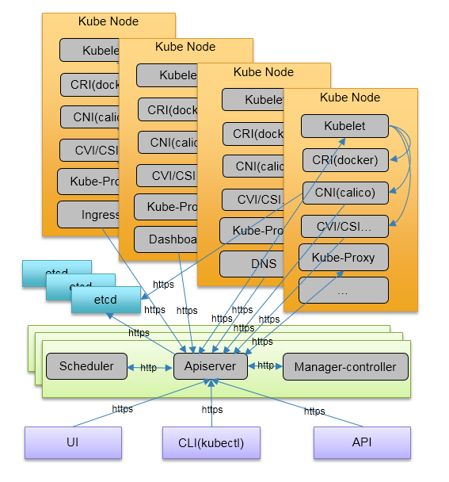

# ansible-kubernetes

Use ansible to install kubernetes cluster platfrom

## Components List
* Kube Master: multi apiserver, scheduler cluster, controller manager cluster
* Kube Node: kubelet, kube-proxy
* Kube Storage: etcd cluster
* Security: enable SSL/TLS
* CRI: docker
* CNI: calico
* Ingress: Nginx
* DNS: kubeDNS, dnsmasq
* UI: dashboard
* CLI: kubectl
* Logger: *(to do)
* Monitor: *(to do)
* Alerter: *(to do)
* CVI: *
* Registry: Harbor(to do)

## Binaries download url list 
* Kube: https://github.com/kubernetes/kubernetes/blob/master/CHANGELOG-1.9.md#downloads-for-v191
* Docker: https://github.com/moby/moby/releases/tag/v1.12.3
* Calicoctl: https://github.com/projectcalico/calicoctl/releases
* CNI: https://github.com/containernetworking/cni/releases
* CFSSL: https://pkg.cfssl.org/

## Images list
* calico/node:v2.6.5
* calico/cni:v1.11.2
* calico/kube-controllers:v1.0.2
* ibmcom/defaultbackend:1.2
* ibmcom/k8s-dns-kube-dns:1.14.1
* ibmcom/k8s-dns-dnsmasq-nanny:1.14.1
* ibmcom/k8s-dns-sidecar:1.14.1
* quay.io/kubernetes-ingress-controller/nginx-ingress-controller:0.9.0
* k8scn/kubernetes-dashboard-amd64:v1.8.0

## Helpful links
* https://cfssl.org/
* http://docs.ansible.com/
* https://kubernetes.io/docs/home/
* https://docs.projectcalico.org/v3.0/introduction/

